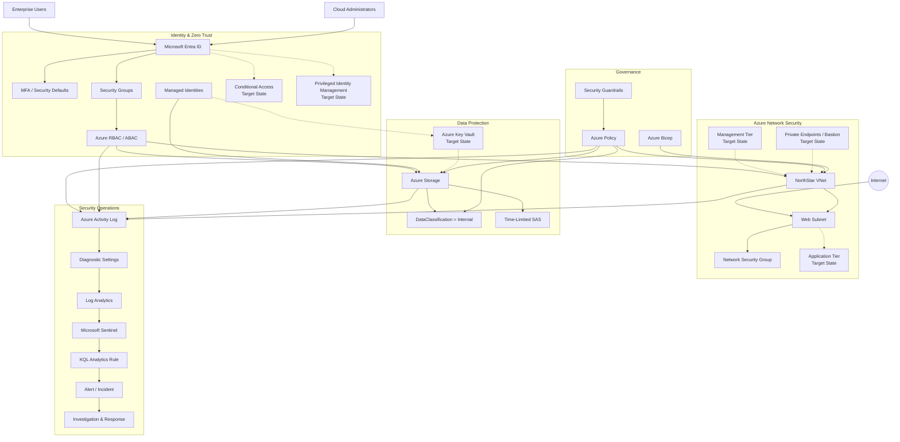

# NorthStar Enterprise Cloud Security Architecture

Enterprise Azure cloud security architecture integrating infrastructure security, Zero Trust identity, data protection, governance, security monitoring, detection engineering, and incident response.

This project is the **flagship architecture project** of the NorthStar Azure Security Portfolio. It brings together the capabilities validated across the infrastructure, identity, and security-operations projects into a unified enterprise security design.

## Architecture



**Solid paths** represent capabilities validated within the NorthStar portfolio.  
**Dashed paths** represent target-state enterprise capabilities.

## Security Architecture

NorthStar follows a defense-in-depth model:

```text
IDENTITY
Microsoft Entra ID → MFA → RBAC / ABAC → Managed Identities
                         │
                         ▼
NETWORK
VNet → Segmentation → NSGs → Controlled Connectivity
                         │
                         ▼
DATA
Classification → Scoped Access → Encryption → Secrets Architecture
                         │
                         ▼
GOVERNANCE
Azure Policy → Guardrails → Compliance → Infrastructure as Code
                         │
                         ▼
DETECT
Activity Log → Log Analytics → Sentinel → KQL Analytics
                         │
                         ▼
RESPOND
Alert → Incident → Investigation → Classification → Resolution
```

## Core Security Domains

| Domain | Architecture |
|---|---|
| Identity & Access | Microsoft Entra ID, MFA, security groups, RBAC, ABAC, managed identities |
| Network Security | Azure VNet, subnet segmentation, NSGs, controlled connectivity |
| Data Protection | Classification, storage authorization, encryption, delegated access |
| Governance | Azure Policy, security guardrails, classification enforcement, Bicep |
| Security Operations | Activity Log, Log Analytics, Microsoft Sentinel, KQL |
| Incident Response | Detection, alerting, investigation, classification and resolution |

## Zero Trust

The architecture applies three core Zero Trust principles:

### Verify Explicitly

Authentication and authorization are evaluated through Microsoft Entra ID, MFA, RBAC, and ABAC rather than assuming trust based on network location.

### Use Least Privilege

Human and workload identities receive only the permissions required for their responsibilities and resource scope.

### Assume Breach

Network segmentation, centralized telemetry, detection engineering, incident investigation, and response provide additional security when preventive controls fail or are bypassed.

## Threat Model

The NorthStar threat model evaluates attack paths involving:

- Compromised identities
- Excessive privilege
- Internet-facing workloads
- Credential and secret exposure
- Security-control tampering
- Unauthorized data access

Each scenario is mapped to preventive, detective, and responsive controls.

See [Enterprise Threat Model](docs/threat-model/enterprise-threat-model.md).

## Security Controls

NorthStar explicitly distinguishes **validated controls** from **target-state architecture**.

Validated capabilities include:

- Microsoft Entra ID
- MFA / Security Defaults
- Azure RBAC and ABAC
- Managed identities
- Azure VNet and NSGs
- Azure Policy
- Data classification
- Azure Bicep
- Azure Activity Log
- Log Analytics
- Microsoft Sentinel
- KQL detection engineering
- Scheduled analytics
- Security alert and incident investigation

Target-state capabilities include:

- Conditional Access
- Privileged Identity Management
- Azure Key Vault
- Azure Bastion
- Private Endpoints / Private Link
- Expanded workload segmentation
- SOAR automation

See [Security Controls Matrix](docs/security-controls/security-controls-matrix.md).

## Governance

NorthStar uses centralized governance to establish consistent security requirements.

A mandatory `DataClassification=Internal` Azure Policy was validated by intentionally attempting a noncompliant resource operation and confirming that Azure denied the operation until the required classification was supplied.

The portfolio also demonstrates an important architectural lesson: governance controls require carefully designed scopes and exceptions because blanket enforcement can interfere with legitimate platform-managed security resources.

See [Governance Framework](docs/governance/governance-framework.md).

## Security Operations

The validated security-operations pipeline is:

```text
Azure Control-Plane Activity
          ↓
Azure Activity Log
          ↓
Subscription Diagnostic Setting
          ↓
Log Analytics
          ↓
Microsoft Sentinel
          ↓
KQL Scheduled Analytics Rule
          ↓
Security Alert
          ↓
Sentinel Incident
          ↓
Investigation
          ↓
Classification
          ↓
Resolution
```

A controlled Azure operation was used to generate a real control-plane failure. The event was ingested into Log Analytics, detected through KQL, converted into a Sentinel alert and incident, investigated, classified as authorized security testing, and resolved.

## Residual Risk

NorthStar recognizes that security controls reduce risk rather than eliminate it.

Residual risks include compromised authorized identities, privilege misuse, application vulnerabilities, detection gaps, credential exposure, and delays associated with manual incident response.

Target-state improvements are documented for each major risk area.

See [Residual Risk Assessment](docs/threat-model/residual-risk.md).

## Architecture Decisions

Major design decisions include:

- Identity as a primary security boundary
- Group-based authorization
- Managed identities for Azure workloads
- Network segmentation
- Centralized policy governance
- Centralized security monitoring
- Analyst validation of security detections
- Clear separation between validated and target-state controls

See [Architecture Decisions & Constraints](docs/architecture/architecture-decisions.md).

## Project Documentation

### Architecture

- [Architecture Scope](docs/architecture/architecture-scope.md)
- [Security Domains](docs/architecture/security-domains.md)
- [Zero Trust Model](docs/zero-trust/zero-trust-model.md)
- [Network Security Architecture](docs/architecture/network-security-architecture.md)
- [Identity Security Architecture](docs/architecture/identity-security-architecture.md)
- [Data Security Architecture](docs/architecture/data-security-architecture.md)
- [Security Operations Architecture](docs/architecture/security-operations-architecture.md)
- [Enterprise Architecture Diagram](docs/architecture/enterprise-architecture-diagram.md)
- [Architecture Decisions & Constraints](docs/architecture/architecture-decisions.md)

### Threat & Risk

- [Enterprise Threat Model](docs/threat-model/enterprise-threat-model.md)
- [Residual Risk Assessment](docs/threat-model/residual-risk.md)

### Governance & Controls

- [Governance Framework](docs/governance/governance-framework.md)
- [Security Controls Matrix](docs/security-controls/security-controls-matrix.md)

## NorthStar Portfolio

This project represents the final stage of a four-project progression:

```text
Project 1
Azure Infrastructure & Troubleshooting
        ↓
Project 2
Enterprise Identity & Zero Trust
        ↓
Project 3
Security Operations & Incident Response
        ↓
Project 4
Enterprise Cloud Security Architecture
```

Together, the projects demonstrate the progression:

**Build → Protect → Detect & Respond → Architect**

## Skills Demonstrated

`Azure` · `Microsoft Entra ID` · `Zero Trust` · `Azure RBAC` · `Azure ABAC` · `Managed Identities` · `Azure Networking` · `NSGs` · `Azure Policy` · `Bicep` · `Log Analytics` · `Microsoft Sentinel` · `KQL` · `Detection Engineering` · `Incident Response` · `Threat Modeling` · `Cloud Governance` · `Security Architecture`

## Scope

NorthStar is a controlled portfolio environment, not a production enterprise deployment.

The project deliberately separates capabilities that were practically validated from target-state controls requiring additional licensing, cost, workload infrastructure, or production-scale implementation.
