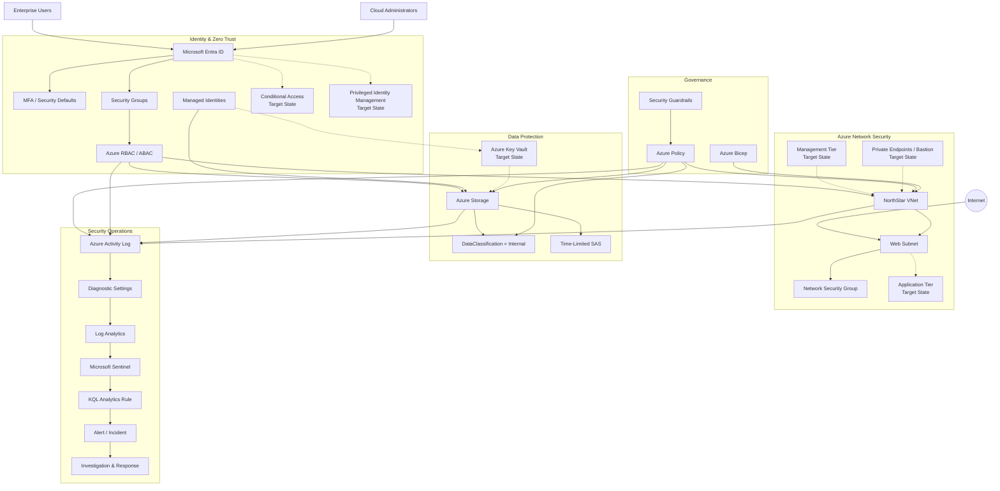

# NorthStar Enterprise Cloud Security Architecture

## Architecture Overview

The following diagram integrates the validated NorthStar security capabilities with clearly identified target-state enterprise controls.



## Diagram Legend

**Solid connections** represent controls or security flows validated within the NorthStar portfolio.

**Dashed connections** represent target-state enterprise capabilities that were not implemented as permanent NorthStar controls.

## Validated Architecture

The portfolio provides practical validation across the following security layers:

```text
Infrastructure
     ↓
Identity & Access
     ↓
Data Protection
     ↓
Cloud Governance
     ↓
Centralized Monitoring
     ↓
Detection Engineering
     ↓
Incident Response
```

## Target-State Extensions

The architecture identifies additional enterprise capabilities without presenting them as implemented lab components:

- Conditional Access
- Privileged Identity Management
- Azure Key Vault
- Expanded application and management segmentation
- Private Endpoints
- Azure Bastion

These controls represent the next maturity level for a production enterprise implementation.

## Architectural Principle

NorthStar combines preventive, detective, and responsive controls rather than relying on a single security boundary.

Identity establishes who or what may request access, authorization determines permitted actions, network controls restrict connectivity, governance establishes guardrails, data controls protect information, and Microsoft Sentinel provides centralized detection and response.
